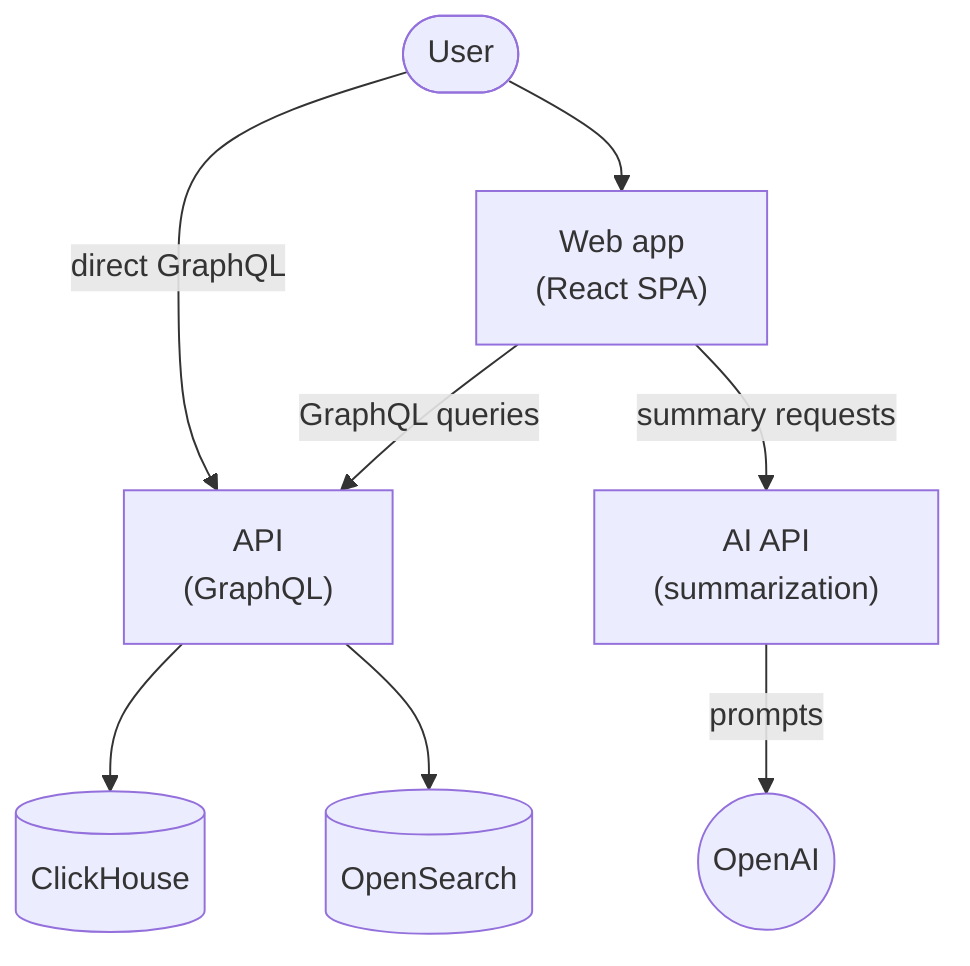
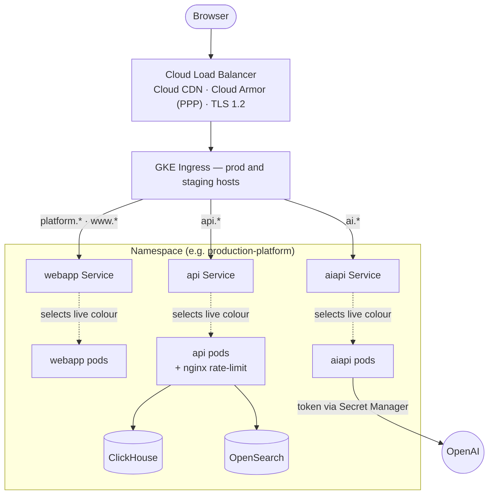

# Technical Overview
## Components
- **Web app** ([ot-ui-apps](https://github.com/opentargets/ot-ui-apps)): React/Vite/MUI
    single-page UI served at [platform.opentargets.org](https://platform.opentargets.org).
- **API** ([platform-api](https://github.com/opentargets/platform-api)): a Scala/Play
    GraphQL service (Sangria). It reads from ClickHouse (via Slick) and OpenSearch
    (via elastic4s). Lives at [api.platform.opentargets.org](https://api.platform.opentargets.org).
- **AI API** ([ot-ai-api](https://github.com/opentargets/ot-ai-api)): NodeJS/LangChain
    router that produces natural-language summaries by forwarding prompts to OpenAI.
- **ClickHouse**: Holds the bulk release data.
- **OpenSearch**: For free-text and entity search.

Users interact through the web app or by querying the public GraphQL API directly.

This platform is duplicate as both the **Public Platform** and the **Partner Preview
Platform**, which is an internal version with some extra data and feature previews
before they become generally available.

!!! info
    We refer to them simple as `platform` and `ppp`.

## Infrastructure
The Platform runs on a single GKE cluster. It is deployed in two separate phases:

1. **Terraform** provisions the cluster and cloud resources
2. **Helm** deploys the applications and databases as a blue/green release.

Platform and PPP are two coexisting deployments of the same chart, each in its
own namespace (`production-platform`, `production-ppp`). Both are deployed in the
same way.

!!! note
    We have both `production` and `devcluster`. `devcluster` comes and goes when
    we need to test new infra stuff. Both are identical except for the GCP project
    they live in. **We should actively try to keep them identical.**

### Stack
- **GCP / GKE**: managed Kubernetes (not autopilot), one private cluster.
- **Terraform**: cluster and cloud resources; state in GCS.
- **Helm**: applications and data backends (one single chart contains blue/green).
- [**Config Connector**](https://docs.cloud.google.com/config-connector/docs/overview):
  Manages GCP resources (static IPs, DNS) from inside the cluster.

### Phases
#### Terraform
As stated above, Terraform sets up the cluster and cloud resources:

- GKE private cluster, REGULAR release channel, weekly maintenance window.
- Four node pools:
    * `production` for the production services.
    * `staging` for staging (scales to 0 when idle).
    * `clickhouse`.
    * `opensearch`.
- VPC and cluster subnet.
- Cloud Router + NAT.
- IAP-only SSH firewall.
- Service accounts and Workload Identity bindings.
- Cloud Armor PPP policy, **used to restrict access to the partners**.
- SSL policy to enforce TLS 1.2 or above.
- `hyperdisk-balanced` StorageClass (required for C4D/N4 machines).
- GCS buckets (Loki logs, Terraform state).
- Config Connector.

#### Helm
After the cluster is up, the Helm chart is in charge of deploying the services and
data backends. It holds both production and staging currently, as the switch is done
at the k8s service level.

##### Services
- `webapp` simple nginx serving a bundle (See [Dockerfile](https://github.com/opentargets/ot-ui-apps/blob/main/apps/platform/Dockerfile)
  and [nginx config](https://github.com/opentargets/ot-ui-apps/blob/main/apps/platform/etc/platform.conf)).
- `api` scala app with an nginx rate-limit sidecar.
- `aiapi` nodejs application.

##### Data backends
Both are StatefulSets, seeded from release snapshots by using VolumeSnapshots that
are filled from VolumeSnapshotContent coming from a GCP Snapshot using the
`pd.csi.storage.gke.io` driver.

- `clickhouse`
- `opensearch`

##### Scaffolding
We have two separations: `colour` (blue/green) at the pod level; and `env`
(production/staging) at the service level. On release day, we switch the envs to
the other color. For this, we have:

- Per-colour NetworkPolicies, HPAs, PDBs.
- Per-env Services, Ingress, ManagedCertificates, Frontend/BackendConfig.
- Global static IPs and DNS records.

## Hosting
GCP, region `europe-west1`. The `production` cluster is in `open-targets-prod`
project. `devcluster` in `open-targets-eu-dev`, more than one could be spawned.
Terraform state is stored in `gs://open-targets-ops` under a per-cluster prefix.
Container images (Artifact Registry, `europe-west1`) and DB snapshots both live
in `open-targets-eu-dev`; the prod cluster reads them cross-project via IAM.

!!! Warning
    This is usually a source of problems. Anything deployed in the `devcluster`
    for testing usually has no permission problems, but `production` later fails,
    because it lives in a different project.

    **Make sure you grant the correct permissions when adding to the infra.**

### Cluster topology
The cluster is private (nodes have no public IP) and zonal (`europe-west1-d`
prod, `-c` dev). Application pods are pinned to the `production` or `staging`
node pool by which colour is live; ClickHouse and OpenSearch pods always run on
their own tainted pools (sized to hold both colours). Each product gets one
namespace (`<prefix>-<product>`), and the two products are independent
deployments of the same chart.

The diagram below shows the request path for one namespace. Each Service targets
whichever colour (`blue`/`green`) is currently live; the idle colour runs in
parallel as staging during a release (see [Release Process](release-process.md)).
When the release passes and things are stable, staging points to production too.

### Networking
- VPC `<prefix>-main`, cluster subnet `10.0.1.0/24`, secondary ranges pods `10.1.0.0/16`
    and services `10.2.0.0/16`.
- Private nodes with Cloud NAT for egress (needed to pull the ClickHouse and
    OpenSearch images). SSH only via IAP.
- One Cloud Load Balancer per env (GKE Ingress + NEGs), with global static IPs and
    DNS managed by Config Connector.
- Two ManagedCertificates per env (active + fallback) for zero-downtime renewals.
    FrontendConfig forces HTTPS and TLS 1.2; BackendConfig sets HSTS and security
    headers, with CDN on for the webapp and off for the APIs.
- NetworkPolicies `default-deny` per namespace and colour, with explicit allows
    (api→CH/OS, ingress→pods, Prometheus→metrics).

### Security
- **Workload Identity** for all GCP access.
- [**Shielded nodes**](https://docs.cloud.google.com/kubernetes-engine/docs/how-to/shielded-gke-nodes)
    (secure boot + integrity monitoring) and **Binary Authorization** enforced.
- **Secret Manager** addon with the Secrets Store CSI driver for application
    secrets (for now OpenAI token).
- **Cloud Armor** restricts PPP to an IP allowlist (from the `ppp-allowlist` module).
    Unmatched traffic is redirected to an unauthorised page.
